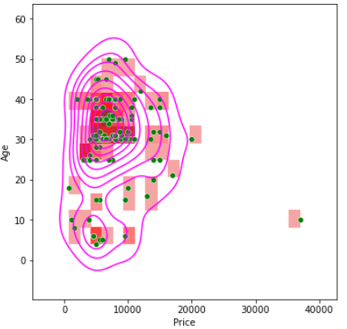
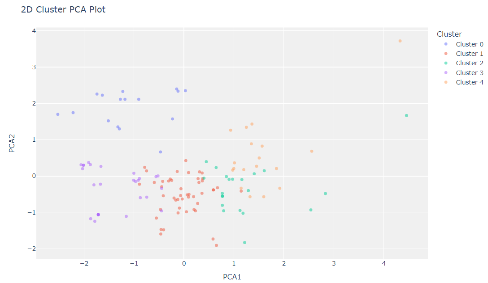

# EndtoEnd-WebScraping-MachineLearning
 I have done Web Scraping to a Real Estate Website and get the rental houses data in a district of Istanbul/Turkey as .csv format using Python Beautiful Soup library to import and pull data from MySQL. After that I use Unsupervised Learning(Clustering) with sklearn to group this houses.

